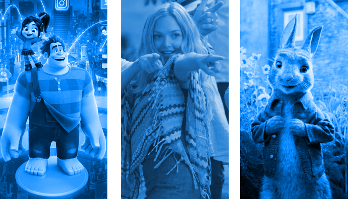

---
title: "Action vs. Comedy"
author: "Andres von Schnehen"
date: "2019"
output: 
  flexdashboard::flex_dashboard:
    theme: united
    orientation: columns
    vertical_layout: scroll
---

```{r setup, include=FALSE}
library(flexdashboard)
library(tidyverse)
library(tidymodels)
library(plotly)
library(spotifyr)
library(compmus)
source('spotify.R')
```

Overview {data-navmenu="Overview"}
=================================================
Column {data-width=650}
-----------------------------------------------------------------------
### Action vs. Comedy: Comparing Different Styles of Film Music

A film's soundtrack has a profound influence on how we perceive what we see on screen, and it is difficult to imagine movies without any background music. With the exception of musicals, our attention is rarely directed explicitly to the music, and yet our experience changes significantly because of the music.

In blockbuster movies, music is usually created or chosen for every single scene in order to underline what is happening in that scene specifically. But can we find general patterns in the types of music chosen for certain types of movies, that is, certain genres?

More specifically, are there systematic differences between music that is composed or selected for action movies and music that is composed for comedy movies? These two types of films usually entertain their audiences in quite different ways. While action movies use suspense, thrill, and impressive visual effects to excite their audience, comedy movies often provide a way for their viewers to relax, wind down, and get a feeling of happiness and pleasure. Since music is used as a means to achieve these quite different goals, it would make sense that the music composed and chosen for each genre would be quite different as well.

To obtain the corpus, the most commercially successful action and comedy movies of 2018 were considered. The box office charts from Box Office Mojo (https://www.boxofficemojo.com/yearly/) were used to determine what movies to include, along with IMDB's information about genre (https://www.imdb.com/). For each film, IMDB lists up to three genres. A movie's soundtrack if and only if the full soundtrack album was available on Spotify, and if the genre of that film according to IMDB was either action or comedy, but not both. This was done starting with the most commercially successful movie (Black Panther) and down the charts until 25 full action movie soundtracks and 25 full comedy movie soundtracks were obtained.

Click through the drop-down menus on the top of the page to explore the audio features of film music according to Spotify API, how they differ between action and comedy film music, and what else stands out.

Column {data-width=350}
-----------------------------------------------------------------------
```{r, out.width = "400px"}

```

```{r, out.width = "400px"}

```

Angry Action, Happy Comedy {data-navmenu="Analyses"}
==================================================

Column {data-width=650}
-----------------------------------------------------------------------

### Valence-energy map

```{r}
action <- get_playlist_audio_features('1175159882', '71EBCZ27SkMXFqJ45u9Wbi') %>%
    add_audio_analysis
comedy <- get_playlist_audio_features('1175159882', '7FMw4QExCSE4bmyMmYwZ7s') %>%
    add_audio_analysis
filmgenres <-
  action %>% mutate(playlist = "Action") %>%
  bind_rows(comedy %>% mutate(playlist = "Comedy"))
actioncomedy <-
  filmgenres %>%                   # Start with awards.
  ggplot(                      # Set up the plot.
    aes(
      x = valence,
      y = energy,
      colour = mode,
      label = track_name
    )
  ) +
  geom_point(alpha = 0.5) +               # Scatter plot.
  geom_rug(size = 0.1) +       # Add 'fringes' to show data distribution.
  facet_wrap(~ playlist) +     # Separate charts per playlist.
  scale_x_continuous(          # Fine-tune the x axis.
    limits = c(0, 1),
    breaks = c(0, 0.50, 1),  # Use grid-lines for quadrants only.
    minor_breaks = NULL      # Remove 'minor' grid-lines.
  ) +
  scale_y_continuous(          # Fine-tune the y axis in the same way.
    limits = c(0, 1),
    breaks = c(0, 0.50, 1),
    minor_breaks = NULL
  ) +
  scale_colour_brewer(         # Use the Color Brewer to choose a palette.
    type = "qual",           # Qualitative set.
    palette = "Dark2"       # Name of the palette is 'Paired'.
  ) +
  labs(                        # Make the titles nice.
    x = "Valence",
    y = "Energy",
    colour = "Mode"
  )
ggplotly(actioncomedy)
```

Column {data-width=350}
-----------------------------------------------------------------------

The graph on the left allows for conclusions to be drawn both about the features of film music in general, as well as about how action movie music and comedy movie music differ from each other.

It appears that in both cases, there is a large of cluster of tracks with a very low valence, approaching zero. While this is normally interpreted as sad (in the case of low energy) or angry (in the case of high energy) music, the low valence may also be a result of film music's character of being in the background and merely accompanying the visual scenes.

While valence seems to be low in general among film music, this is less true for comedy music. Compared to action film music, comedy music has especially more tracks falling in the top-right quadrant of the valence-energy map, which is considered the quadrant describing 'happy' music. This make intuitive sense - we expect music in comedy films to be uplifting, funny, happy. 
On the other hand, a lot more action movie tracks than comedy movie tracks seem to fall in the top-left quadrant, usually describing 'angry' music. Again, this is in line with our intuitions about music in action movies: Fast-paced, suspenseful, intense but not usually very happy-sounding.

The graph also seems to suggest that comedy soundtracks contain more major songs compared to action soundtracks, a pattern that will be explored on the next page.

Functions of chroma {data-navmenu="Analyses"}
============================================

Column {.tabset}
-------------------------------------------------------

### Top of the Tower

```{r}
tower_spect <- 
    get_tidy_audio_analysis('29OyX4Mr55qyx9rstIKMhW') %>% 
    select(segments) %>% unnest(segments) %>% 
    select(start, duration, pitches)
```

```{r}
tower_spect %>% 
    mutate(pitches = map(pitches, compmus_normalise, 'chebyshev')) %>% 
    compmus_gather_chroma %>% 
    ggplot(
        aes(
            x = start + duration / 2, 
            width = duration, 
            y = pitch_class, 
            fill = value)) + 
    geom_tile() +
    labs(x = 'Time (s)', y = NULL, fill = 'Magnitude') +
    theme_minimal()
```

### Overnight Sensation

```{r}
sensation_spect <- 
    get_tidy_audio_analysis('7jmc334Y4VdqEGGVFyLm7q') %>% 
    select(segments) %>% unnest(segments) %>% 
    select(start, duration, pitches)
```

```{r}
sensation_spect %>% 
    mutate(pitches = map(pitches, compmus_normalise, 'chebyshev')) %>% 
    compmus_gather_chroma %>% 
    ggplot(
        aes(
            x = start + duration / 2, 
            width = duration, 
            y = pitch_class, 
            fill = value)) + 
    geom_tile() +
    labs(x = 'Time (s)', y = NULL, fill = 'Magnitude') +
    theme_minimal()
```

Column
-------------------------------------------------------

The valence-energy graph under the **Audio features** tab shows that compared to comedy movies, action movies have more tracks that fall in the upper-left quadrant, low valence but high energy, often characterised as "angry" songs. On the other hand, comedy movies seem to have more tracks falling into the upper-right quadrant, high valence and high energy, often characterised as "happy" songs.

On the left, in the first tab, we see a spectrogram and cepstogram for a typical "angry" song from our sample drawn from action movies, *Top of the Tower*, from *The Equalizer 2*. In the second tab, we see a spectorgram and cepstogram for a typical "happy" song from our sample drawn from comedy movies, *Overnight Sensation* from *Ralph Breaks the Internet*.

A look at the chromagrams reveals that for the action song *Top of the Tower*, most of the power is concentrated around C, which is a very dominant note in the song. Moreover, the song achieves its feeling of suspense by creating a dissonance with the use of minor seconds, indicated by the relatively high power around C# and B. In contrast, the comedy song *Overnight sensation* has its power much more evenly distributed across all tones of the scale, which can be heard in the song that uses lots of diverse intervals, chords, and key change.

Timbre {data-navmenu="Analyses"}
===============================================================
Column {.tabset}
-------------------------------------------------------

### Top of the Tower

```{r}
tower_cepst <- 
    get_tidy_audio_analysis('29OyX4Mr55qyx9rstIKMhW') %>% 
    compmus_align(bars, segments) %>% 
    select(bars) %>% unnest(bars) %>% 
    mutate(
        pitches = 
            map(segments, 
                compmus_summarise, pitches, 
                method = 'rms', norm = 'euclidean')) %>% 
    mutate(
        timbre = 
            map(segments, 
                compmus_summarise, timbre, 
                method = 'mean'))
                
tower_cepst %>% 
    compmus_gather_timbre %>% 
    ggplot(
        aes(
            x = start + duration / 2, 
            width = duration, 
            y = basis, 
            fill = value)) + 
    geom_tile() +
    labs(x = 'Time (s)', y = NULL, fill = 'Magnitude') +
    scale_fill_viridis_c(option = 'E') +
    theme_classic()
```
   
### Overnight Sensation   
   
```{r}                
sensation_cepst <- 
    get_tidy_audio_analysis('7jmc334Y4VdqEGGVFyLm7q') %>% 
    compmus_align(bars, segments) %>% 
    select(bars) %>% unnest(bars) %>% 
    mutate(
        pitches = 
            map(segments, 
                compmus_summarise, pitches, 
                method = 'rms', norm = 'euclidean')) %>% 
    mutate(
        timbre = 
            map(segments, 
                compmus_summarise, timbre, 
                method = 'mean'))

sensation_cepst %>% 
    compmus_gather_timbre %>% 
    ggplot(
        aes(
            x = start + duration / 2, 
            width = duration, 
            y = basis, 
            fill = value)) + 
    geom_tile() +
    labs(x = 'Time (s)', y = NULL, fill = 'Magnitude') +
    scale_fill_viridis_c(option = 'E') +
    theme_classic()
```

Column
-------------------------------------------------------
When comparing the same songs, *Top of the Tower* and *Overnight Sensation*, it appears that *Top of the Tower* seems to have a higher level of brightness. However, it also visible that after around 100 seconds, there is a sudden drop in brightness. This corresponds to a monotonous, mellow part of a song that follows an energetic climax.

Dynamic time warping {data-navmenu="Analyses"}
===============================================================

Column {.tabset}
------------------------------------------------------
### Mammia Mia

```{r}
mammamia_normal <- 
    get_tidy_audio_analysis('2TxCwUlqaOH3TIyJqGgR91') %>% 
    select(segments) %>% unnest(segments) %>% 
    select(start, duration, pitches)
mammamia_film <- 
    get_tidy_audio_analysis('717z018DWodjJnW6DE7t4z') %>% 
    select(segments) %>% unnest(segments) %>% 
    select(start, duration, pitches)
```

```{r}
compmus_long_distance(
    mammamia_normal %>% mutate(pitches = map(pitches, compmus_normalise, 'chebyshev')),
    mammamia_film %>% mutate(pitches = map(pitches, compmus_normalise, 'chebyshev')),
    feature = pitches,
    method = 'euclidean') %>% 
    ggplot(
        aes(
            x = xstart + xduration / 2, 
            width = xduration,
            y = ystart + yduration / 2,
            height = yduration,
            fill = d)) + 
    geom_tile() +
    scale_fill_continuous(type = 'viridis', guide = 'none') +
    labs(x = 'Original version', y = 'Mamma Mia: Here We Go Again version') +
    theme_minimal()
```

### In This Place

```{r}
place_normal <- 
    get_tidy_audio_analysis('2cOE7d35PyfAh9M7DglPk0') %>% 
    select(segments) %>% unnest(segments) %>% 
    select(start, duration, pitches)
place_instrumental <- 
    get_tidy_audio_analysis('59umldOdegg8iQGFbtFX0Y') %>% 
    select(segments) %>% unnest(segments) %>% 
    select(start, duration, pitches)
```

```{r}
compmus_long_distance(
    place_normal %>% mutate(pitches = map(pitches, compmus_normalise, 'chebyshev')),
    place_instrumental %>% mutate(pitches = map(pitches, compmus_normalise, 'chebyshev')),
    feature = pitches,
    method = 'euclidean') %>% 
    ggplot(
        aes(
            x = xstart + xduration / 2, 
            width = xduration,
            y = ystart + yduration / 2,
            height = yduration,
            fill = d)) + 
    geom_tile() +
    scale_fill_continuous(type = 'viridis', guide = 'none') +
    labs(x = 'Original version', y = 'Instrumental version') +
    theme_minimal()
```

### Everything I Need

```{r}
everything_normal <- 
    get_tidy_audio_analysis('3pDHW8LsKjbX6nVSbs8uGU') %>% 
    select(segments) %>% unnest(segments) %>% 
    select(start, duration, pitches)
everything_film <- 
    get_tidy_audio_analysis('2qiOvWyHX28d8nrWTio3yV') %>% 
    select(segments) %>% unnest(segments) %>% 
    select(start, duration, pitches)
```

```{r}
compmus_long_distance(
    everything_normal %>% mutate(pitches = map(pitches, compmus_normalise, 'chebyshev')),
    everything_film %>% mutate(pitches = map(pitches, compmus_normalise, 'chebyshev')),
    feature = pitches,
    method = 'euclidean') %>% 
    ggplot(
        aes(
            x = xstart + xduration / 2, 
            width = xduration,
            y = ystart + yduration / 2,
            height = yduration,
            fill = d)) + 
    geom_tile() +
    scale_fill_continuous(type = 'viridis', guide = 'none') +
    labs(x = 'Original version', y = 'Film version') +
    theme_minimal()
```

Column
-------------------------------------------------------

Sometimes existing songs are re-recorded or edited to create an alternative version for a movie. Comparing the movie version to the original verion may tell us a bit about the attributes of film music in general.

In the first tab on the left, you see Dynamic Time Warping applied to two different versions of the song **Mammia Mia** by **ABBA**. Specifically, it compares the original version from 1975 to the one performed by the cast of *Mamma Mia: Here We Go Again* (2018). Interestingly, some sections of the songs seem to be very similar between the two versions, whereas others are not. For the first 45 seconds of the song, we do not see a distinct diagonal line going through the graph, indicating that the versions are vastly different. The film version has a very slow, variable-tempo, acoustic intro, whereas the original song starts as upbeat as the rest of the song. Only from 00:45, the film version sounds more like original version, at which point we also see a diagonal line going through the graph. Looking at the graph as a whole reveals sections of the song where film and original version are similar and where they are more different.

The soundtrack of *Ralph Breaks the Internet* features two versions of the song **In this Place**, one instrumental and one featuring *Julia Michael's* voice. Compared to the the **Mamma Mia** graph, we see a much more distinct dark diagonal line going through the whole song. This indicates that the original version and instrumental version are very similar, at least in terms of chroma. However, we also do see that about 10 seconds into the song, precisely where *Julia Michael* starts singing in the original version, the line becomes a little less clear, indicating that the singers' voice does have a visible effect on the song's chroma features.

Finally, *Aquaman's* soundtrack features the original version of the song **Everything I need** by **Skylar Grey**, as well as a modified version made for the film. The graph on the left reveals that these two versons are relatively similar in terms of chroma, but do contain quite some differences. The fact that the diagonal line does not go through the origin (0, 0) of the coordinate system, but rather intersects the x-axis at around 15 seconds indicates that the original version contains a short intro not contained in the film version.

Self-similarity matrices {data-navmenu="Analyses"}
================================================================

Column {.tabset}
-------------------------------------------------------
### Top of the Tower · Chroma

```{r}
tower_spect %>% 
    compmus_self_similarity(pitches, 'cosine') %>% 
    ggplot(
        aes(
            x = xstart + xduration / 2, 
            width = xduration,
            y = ystart + yduration / 2,
            height = yduration,
            fill = d)) + 
    geom_tile() +
    coord_fixed() +
    scale_fill_viridis_c(option = 'E', guide = 'none') +
    theme_classic() +
    labs(x = '', y = '')
```

### Top of the Tower · Timbre

```{r}
tower_cepst %>% 
    compmus_self_similarity(timbre, 'cosine') %>% 
    ggplot(
        aes(
            x = xstart + xduration / 2, 
            width = xduration,
            y = ystart + yduration / 2,
            height = yduration,
            fill = d)) + 
    geom_tile() +
    coord_fixed() +
    scale_fill_viridis_c(option = 'E', guide = 'none') +
    theme_classic() +
    labs(x = '', y = '')
```

### Overnight Sensation · Chroma

```{r}
sensation_spect %>% 
    compmus_self_similarity(pitches, 'cosine') %>% 
    ggplot(
        aes(
            x = xstart + xduration / 2, 
            width = xduration,
            y = ystart + yduration / 2,
            height = yduration,
            fill = d)) + 
    geom_tile() +
    coord_fixed() +
    scale_fill_viridis_c(option = 'E', guide = 'none') +
    theme_classic() +
    labs(x = '', y = '')
```

### Overnight Sensation · Timbre

```{r}
sensation_cepst %>% 
    compmus_self_similarity(timbre, 'cosine') %>% 
    ggplot(
        aes(
            x = xstart + xduration / 2, 
            width = xduration,
            y = ystart + yduration / 2,
            height = yduration,
            fill = d)) + 
    geom_tile() +
    coord_fixed() +
    scale_fill_viridis_c(option = 'E', guide = 'none') +
    theme_classic() +
    labs(x = '', y = '')
```

Column
-------------------------------------------------------

The structure of a song can be evaluated by means of a self-similarity matrix. Such matrices have been computed for the archetypical action and comedy songs, respectively, **Top of the Tower** (action) and **Overnight Sensation** (comedy). Self-similarity matrices can be computed on chroma and on timbre features, both of which was done here, resulting in a total of four matrices.

The action song, **Top of the Tower**, sounds relatively monotonous in terms of chroma (mostly lingering on pitch C, somtimes alternating with C#), and more diverse in terms of timbre, with some mellow mostly-electronic sounds in the beginning, and more of an orchestral sound in the end. Both of these observations are illustrated in the self-similarity matrices. The chroma changes relatively little throughout the song, except a part at the end. The timbre stays relatively constant in the first half of the song, but then seems to change quite substantially, as the song begins to sound more epic and orchestral. Both of these features are used to create a feeling of suspense, making this song fit well within an action film soundtrack.

In contrast, in the case of the comedy song, **Overnight Sensation**, change seems to be the only constant. In terms of chroma, the matrix looks so chaotic that probably the song does not have a clear structure. In fact, I think the point of this song is that there is "a lot going on", and the lack of a structure is used as stylistic device. Running the song through Chordify yields a small number of chords that repeat relatively consistently, but a clear chromatic structure is still not picked up, probably because the chords are quite unrelated to each other (in a music theoretical sense), so the notes contained in one chord may be completely different from the notes contained in the previous chord. Timbre-wise, there seems to be some structure, with different parts each lasting 20-25 seconds long, but it is still relatively chaotic, especially when compared with the action song.

Building suspense by key {data-navmenu="Analyses"}
======================================================

```{r}
circshift <- function(v, n) {if (n == 0) v else c(tail(v, n), head(v, -n))}
                                    
    # C     C#    D     Eb    E     F     F#    G     Ab    A     Bb    B 
major_chord <- 
    c(1,    0,    0,    0,    1,    0,    0,    1,    0,    0,    0,    0)
minor_chord <- 
    c(1,    0,    0,    1,    0,    0,    0,    1,    0,    0,    0,    0)
seventh_chord <- 
    c(1,    0,    0,    0,    1,    0,    0,    1,    0,    0,    1,    0)
major_key <- 
    c(6.35, 2.23, 3.48, 2.33, 4.38, 4.09, 2.52, 5.19, 2.39, 3.66, 2.29, 2.88)
minor_key <-
    c(6.33, 2.68, 3.52, 5.38, 2.60, 3.53, 2.54, 4.75, 3.98, 2.69, 3.34, 3.17)
chord_templates <-
    tribble(
        ~name  , ~template,
        'Gb:7'  , circshift(seventh_chord,  6),
        'Gb:maj', circshift(major_chord,    6),
        'Bb:min', circshift(minor_chord,   10),
        'Db:maj', circshift(major_chord,    1),
        'F:min' , circshift(minor_chord,    5),
        'Ab:7'  , circshift(seventh_chord,  8),
        'Ab:maj', circshift(major_chord,    8),
        'C:min' , circshift(minor_chord,    0),
        'Eb:7'  , circshift(seventh_chord,  3),
        'Eb:maj', circshift(major_chord,    3),
        'G:min' , circshift(minor_chord,    7),
        'Bb:7'  , circshift(seventh_chord, 10),
        'Bb:maj', circshift(major_chord,   10),
        'D:min' , circshift(minor_chord,    2),
        'F:7'   , circshift(seventh_chord,  5),
        'F:maj' , circshift(major_chord,    5),
        'A:min' , circshift(minor_chord,    9),
        'C:7'   , circshift(seventh_chord,  0),
        'C:maj' , circshift(major_chord,    0),
        'E:min' , circshift(minor_chord,    4),
        'G:7'   , circshift(seventh_chord,  7),
        'G:maj' , circshift(major_chord,    7),
        'B:min' , circshift(minor_chord,   11),
        'D:7'   , circshift(seventh_chord,  2),
        'D:maj' , circshift(major_chord,    2),
        'F#:min', circshift(minor_chord,    6),
        'A:7'   , circshift(seventh_chord,  9),
        'A:maj' , circshift(major_chord,    9),
        'C#:min', circshift(minor_chord,    1),
        'E:7'   , circshift(seventh_chord,  4),
        'E:maj' , circshift(major_chord,    4),
        'G#:min', circshift(minor_chord,    8),
        'B:7'   , circshift(seventh_chord, 11),
        'B:maj' , circshift(major_chord,   11),
        'D#:min', circshift(minor_chord,    3),
)
key_templates <-
    tribble(
        ~name    , ~template,
        'Gb:maj', circshift(major_key,  6),
        'Bb:min', circshift(minor_key, 10),
        'Db:maj', circshift(major_key,  1),
        'F:min' , circshift(minor_key,  5),
        'Ab:maj', circshift(major_key,  8),
        'C:min' , circshift(minor_key,  0),
        'Eb:maj', circshift(major_key,  3),
        'G:min' , circshift(minor_key,  7),
        'Bb:maj', circshift(major_key, 10),
        'D:min' , circshift(minor_key,  2),
        'F:maj' , circshift(major_key,  5),
        'A:min' , circshift(minor_key,  9),
        'C:maj' , circshift(major_key,  0),
        'E:min' , circshift(minor_key,  4),
        'G:maj' , circshift(major_key,  7),
        'B:min' , circshift(minor_key, 11),
        'D:maj' , circshift(major_key,  2),
        'F#:min', circshift(minor_key,  6),
        'A:maj' , circshift(major_key,  9),
        'C#:min', circshift(minor_key,  1),
        'E:maj' , circshift(major_key,  4),
        'G#:min', circshift(minor_key,  8),
        'B:maj' , circshift(major_key, 11),
        'D#:min', circshift(minor_key,  3))
```

Column {.tabset}
---------------------------------------------------------

### It's Only One Red Sock

```{r}
sock <- 
    get_tidy_audio_analysis('4HiIVF61JyikxgeNQAihGU') %>% 
    compmus_align(sections, segments) %>% 
    select(sections) %>% unnest(sections) %>% 
    mutate(
        pitches = 
            map(segments, 
                compmus_summarise, pitches, 
                method = 'mean', norm = 'manhattan'))

sock %>% 
    compmus_match_pitch_template(key_templates, 'euclidean', 'manhattan') %>% 
    ggplot(
        aes(x = start + duration / 2, width = duration, y = name, fill = d)) +
    geom_tile() +
    scale_fill_viridis_c(option = 'E', guide = 'none') +
    theme_minimal() +
    labs(x = 'Time (s)', y = '')
```

### Train Heist

```{r}
train <- 
    get_tidy_audio_analysis('1ezCMM6GbB6JW6yXltlCaD') %>% 
    compmus_align(sections, segments) %>% 
    select(sections) %>% unnest(sections) %>% 
    mutate(
        pitches = 
            map(segments, 
                compmus_summarise, pitches, 
                method = 'mean', norm = 'manhattan'))

train %>% 
    compmus_match_pitch_template(key_templates, 'euclidean', 'manhattan') %>% 
    ggplot(
        aes(x = start + duration / 2, width = duration, y = name, fill = d)) +
    geom_tile() +
    scale_fill_viridis_c(option = 'E', guide = 'none') +
    theme_minimal() +
    labs(x = 'Time (s)', y = '')
```

Column
---------------------------------------------------------

As illustrated in the graph under **Audio features**, "relaxed songs", that is, those with high valence and low energy, tend to be written in a major key. However, there are exceptions and it may be interesting to look at one of them. One of these exceptions, from the comedy movie *Paddington 2*, is the track *It's Only One Red Sock*. Listening to it gives us an idea why this song is in this unique position. It sounds like a song that is made for a gripping, suspenseful scene, but it simultaneously has a jolly and playful character, reminding us that it is still from a children's movie.

The key profile in the first tab on the left reveals that this song has essentially a three-part structure, one dominated by an B minor chord, an interlude dominated by its subdominant, E minor, and a final part that is in B minor again. However, the final section does not quite look like the first one. Indeed, new chords are introducted in between, and notes that are not part of the chord are played in the background, leading to a keygram where there is power in almost every chord label.

Let's look at a different example, *Train Heist* from *Solo: A Star Wars Story*, a track that with his relatively low valence and medium energy, represents a typical Action movie song. This keygram looks comparatively more complex, and sounds like it would accompany a suspenseful scene with many twists - marked by many key changes. A quiet intro in C minor is followed by a slightly more energetic, but still melancholic part in F minor. The following part in D minor slowly builds up the suspense and makes the song increase in energy. The key shifts to E minor and back to D minor. At the song's climax there is power corresponding to many different chords, in line with the sudden harmonic changes and the use of dissonance in the music. After using predominantly minor keys, the song ends with a finale in E major, sounding significantly happier and more triumphant than the rest of the song, presumably indicating that the heist has been a success.

Classification  {data-navmenu="Analyses"}
======================================================

```{r}
filmgenres <-
  action %>% mutate(playlist = "Action") %>%
  bind_rows(comedy %>% mutate(playlist = "Comedy")) %>%
    mutate(playlist = factor(playlist)) %>% 
    mutate(
        segments = 
            map2(segments, key, compmus_c_transpose)) %>%
    mutate(
        pitches = 
            map(segments, 
                compmus_summarise, pitches, 
                method = 'mean', norm = 'manhattan'),
        timbre =
            map(
                segments,
                compmus_summarise, timbre,
                method = 'mean')) %>%
    mutate(pitches = map(pitches, compmus_normalise, 'clr')) %>% 
    mutate_at(vars(pitches, timbre), map, bind_rows) %>% 
    unnest(pitches, timbre)  
```

```{r}
film_class <- 
    recipe(playlist ~
               danceability +
               energy +
               loudness +
               speechiness +
               acousticness +
               instrumentalness +
               liveness +
               valence +
               tempo +
               duration_ms +
               C + `C#|Db` + D + `D#|Eb` +
               E + `F` + `F#|Gb` + G +
               `G#|Ab` + A + `A#|Bb` + B +
               c01 + c02 + c03 + c04 + c05 + c06 +
               c07 + c08 + c09 + c10 + c11 + c12,
           data = filmgenres) %>% 
    step_center(all_predictors()) %>%
    step_scale(all_predictors()) %>%
    # step_range(all_predictors()) %>% 
    prep(filmgenres) %>% 
    juice
```

```{r}
film_cv <- film_class %>% vfold_cv(10) # change this to 10 !
```

Column {.tabset}
---------------------------------------------------------
### Most important features

```{r, include=FALSE}
film_forest <- rand_forest() %>% set_engine('randomForest')
predict_forest <- function(split)
    fit(film_forest, playlist ~ ., data = analysis(split)) %>% 
    predict(assessment(split), type = 'class') %>%
    bind_cols(assessment(split))
```

```{r, include=FALSE}
film_cv %>% 
    mutate(pred = map(splits, predict_forest)) %>% 
    unnest(pred) %>% 
    metric_set(accuracy, kap, j_index)(truth = playlist, estimate = .pred_class)
```

```{r}
film_class %>% 
    fit(film_forest, playlist ~ ., data = .) %>% 
    pluck('fit') %>% 
    randomForest::varImpPlot()
```

### Classification using all predictors

```{r, include=FALSE}
film_knn <- nearest_neighbor(neighbors = 1) %>% set_engine('kknn')
predict_knn <- function(split)
    fit(film_knn, playlist ~ ., data = analysis(split)) %>% 
    predict(assessment(split), type = 'class') %>%
    bind_cols(assessment(split))
```

```{r, include=FALSE}
film_cv %>% 
    mutate(pred = map(splits, predict_knn)) %>% unnest(pred) %>% 
    conf_mat(truth = playlist, estimate = .pred_class)
```

```{r}
film_cv %>% 
    mutate(pred = map(splits, predict_knn)) %>% unnest(pred) %>% 
    conf_mat(truth = playlist, estimate = .pred_class) %>% 
    autoplot(type = 'mosaic')
```

### Classification using most important predictors

```{r, include=FALSE}
predict_knn_reduced <- function(split)
    fit(
        film_knn, 
        playlist ~ c06 + valence + c04 + instrumentalness + c05 + duration_ms + c09 + danceability + c07, 
        data = analysis(split)) %>% 
    predict(assessment(split), type = 'class') %>%
    bind_cols(assessment(split))
film_cv %>% 
    mutate(pred = map(splits, predict_knn_reduced)) %>% unnest(pred) %>% 
    metric_set(accuracy, kap, j_index)(truth = playlist, estimate = .pred_class)
```

```{r, include=FALSE}
film_cv %>% 
    mutate(pred = map(splits, predict_knn_reduced)) %>% unnest(pred) %>% 
    conf_mat(truth = playlist, estimate = .pred_class)
```

```{r}
film_cv %>% 
    mutate(pred = map(splits, predict_knn_reduced)) %>% unnest(pred) %>% 
    conf_mat(truth = playlist, estimate = .pred_class) %>% 
    autoplot(type = 'mosaic')
```

Column
---------------------------------------------------------
Using a classifier on the corpus can give us some indication how different the two types of music are and how well R classifies music correctly as belonging to Action or Comedy soundtracks.

Random Forests (first tab) allow us to identify the most important features, that is, the features that most reliably distinguish action from comedy film music. For our sample, these appear to be timbre components 6, 4, 5, 9, and 7, as well as the features valence, instrumentalness, duration, and danceability.

The second tab shows the classifier's performance if *all* features are taken into account. As the mosaic plot indicates, accuracy is fairly high (0.728). Below is the confusion matrix of the model with all features.

```{r}
film_cv %>% 
    mutate(pred = map(splits, predict_knn)) %>% unnest(pred) %>% 
    conf_mat(truth = playlist, estimate = .pred_class)
```

The third tab shows the performance if only the five most important timbre components and the other four most important audio features are included in the model. Accuracy of the classifier increases, but only by a little (0.738). Below is the confusion matrix with only the selected features.

```{r}
film_cv %>% 
    mutate(pred = map(splits, predict_knn_reduced)) %>% unnest(pred) %>% 
    conf_mat(truth = playlist, estimate = .pred_class)
```

Conclusions {data-navmenu="Conclusions"}
======================================================

To be added at a later stage.