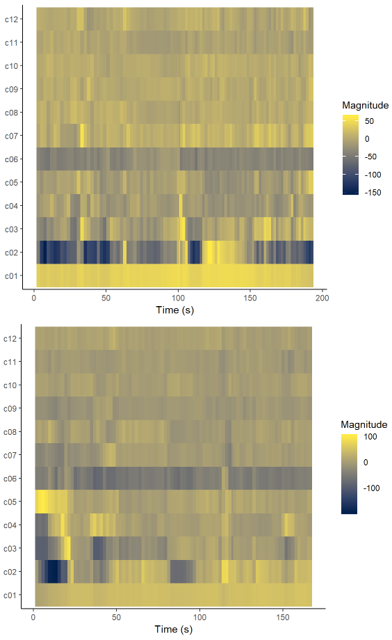

---
title: "Action vs. Comedy"
author: "Andres von Schnehen"
date: "2019"
output: 
  flexdashboard::flex_dashboard:
    orientation: columns
    vertical_layout: fill
---

```{r setup, include=FALSE}
library(flexdashboard)
library(tidyverse)
library(plotly)
library(spotifyr)
source('spotify.R')
```

Overview
=================================================

### Action vs. Comedy: Comparing Different Styles of Film Music

A film's soundtrack has a profound influence on how we perceive what we see on screen, and it is difficult to imagine movies without any background music. With the exception of musicals, our attention is rarely directed explicitly to the music, and yet our experience changes significantly because of the music.

In blockbuster movies, music is usually created or chosen for every single scene in order to underline what is happening in that scene specifically. But can we find general patterns in the types of music chosen for certain types of movies, that is, certain genres?

More specifically, are there systematic differences between music that is composed or selected for action movies and music that is composed for comedy movies? These two types of films usually entertain their audiences in quite different ways. While action movies use suspense, thrill, and impressive visual effects to excite their audience, comedy movies often provide a way for their viewers to relax, wind down, and get a feeling of happiness and pleasure. Since music is used as a means to achieve these quite different goals, it would make sense that the music composed and chosen for each genre would be quite different as well.


Audio features
==================================================

Column {data-width=650}
-----------------------------------------------------------------------

### Valence-energy map

```{r}
action <- get_playlist_audio_features('1175159882', '71EBCZ27SkMXFqJ45u9Wbi')
comedy <- get_playlist_audio_features('1175159882', '7FMw4QExCSE4bmyMmYwZ7s')
filmgenres <-
  action %>% mutate(playlist = "Action") %>%
  bind_rows(comedy %>% mutate(playlist = "Comedy"))
actioncomedy <-
  filmgenres %>%                   # Start with awards.
  ggplot(                      # Set up the plot.
    aes(
      x = valence,
      y = energy,
      colour = mode,
      label = track_name
    )
  ) +
  geom_point(alpha = 0.5) +               # Scatter plot.
  geom_rug(size = 0.1) +       # Add 'fringes' to show data distribution.
  facet_wrap(~ playlist) +     # Separate charts per playlist.
  scale_x_continuous(          # Fine-tune the x axis.
    limits = c(0, 1),
    breaks = c(0, 0.50, 1),  # Use grid-lines for quadrants only.
    minor_breaks = NULL      # Remove 'minor' grid-lines.
  ) +
  scale_y_continuous(          # Fine-tune the y axis in the same way.
    limits = c(0, 1),
    breaks = c(0, 0.50, 1),
    minor_breaks = NULL
  ) +
  scale_colour_brewer(         # Use the Color Brewer to choose a palette.
    type = "qual",           # Qualitative set.
    palette = "Dark2"       # Name of the palette is 'Paired'.
  ) +
  labs(                        # Make the titles nice.
    x = "Valence",
    y = "Energy",
    colour = "Mode"
  )
ggplotly(actioncomedy)
```

Column {data-width=350}
-----------------------------------------------------------------------

The graph on the left allows for conclusions to be drawn both about the features of film music in general, as well as about how action movie music and comedy movie music differ from each other.

It appears that in both cases, there is a large of cluster of tracks with a very low valence, approaching zero. While this is normally interpreted as sad (in the case of low energy) or angry (in the case of high energy) music, the low valence may also be a result of film music's character of being in the background and merely accompanying the visual scenes.

While valence seems to be low in general among film music, this is less true for comedy music. Compared to action film music, comedy music has especially more tracks falling in the top-right quadrant of the valence-energy map, which is considered the quadrant describing 'happy' music. This make intuitive sense - we expect music in comedy films to be uplifting, funny, happy. 
On the other hand, a lot more action movie tracks than comedy movie tracks seem to fall in the top-left quadrant, usually describing 'angry' music. Again, this is in line with our intuitions about music in action movies: Fast-paced, suspenseful, intense but not usually very happy-sounding.

The graph also seems to suggest that comedy soundtracks contain more major songs compared to action soundtracks, a pattern that will be explored on the next page.


Major-minor songs
============================================

Column {data-width = 700}
-------------------------------------------------------

```{r}
ost_action <- get_playlist_audio_features('1175159882', '71EBCZ27SkMXFqJ45u9Wbi')
ost_comedy <- get_playlist_audio_features('1175159882', '7FMw4QExCSE4bmyMmYwZ7s')

action_mode <- data.frame(pull(ost_action, var = mode), "action")
comedy_mode <- data.frame(pull(ost_comedy, var = mode), "comedy")

colnames(action_mode)[1] <- "mode"
colnames(action_mode)[2] <- "genre"
colnames(comedy_mode)[1] <- "mode"
colnames(comedy_mode)[2] <- "genre"

mode <- add_row(action_mode, mode = comedy_mode$mode, genre = comedy_mode$genre)

majorminorplot <- ggplot(mode, aes(x= mode, fill = mode)) +
  geom_bar(show.legend = FALSE) +
  facet_wrap(genre ~ .) +
  labs(x = "Mode", y = "Number of tracks") +
  scale_fill_manual(values=c("#2ca25f", "#de2d26"))

ggplotly(majorminorplot)
```

Column {data-width = 300}
-------------------------------------------------------

The bar graph confirms the expectation stated on the previous page that comedy movie songs indeed are more likely than action movie songs to be in a major key. Moreover, it appears that generally film music is more often in a a major rather than minor key.

Chromagrams & Cepstograms
============================================

Column {data-width = 350}
-------------------------------------------------------

```{r}
#' Get a tidy audio analysis from Spotify.
#'
#' spotifyr returns Spotify's audio analysis as a large list. This function
#' uses list columns to create a structure that works more richly within the
#' tidyverse.
get_tidy_audio_analysis <- function(track_uri, ...) 
{
    get_track_audio_analysis(track_uri, ...) %>% 
        list %>% transpose %>% as_tibble %>% 
        mutate_at(vars(meta, track), . %>% map(as_tibble)) %>% 
        unnest(meta, track) %>% 
        select(
            analyzer_version,
            duration,
            contains('fade'),
            ends_with('confidence'),
            bars:segments) %>% 
        mutate_at(
            vars(bars, beats, tatums, sections), 
            . %>% map(bind_rows)) %>% 
        mutate(
            segments =
                map(
                    segments,
                    . %>% 
                        transpose %>% as_tibble %>% 
                        unnest(.preserve = c(pitches, timbre)) %>% 
                        mutate(
                            pitches = 
                                map(
                                    pitches, 
                                    . %>% 
                                        flatten_dbl %>% 
                                        set_names(
                                            c( 
                                                'C', 'C#|Db', 'D', 'D#|Eb', 
                                                'E', 'F', 'F#|Gb', 'G',
                                                'G#|Ab', 'A', 'A#|Bb', 'B'))),
                            timbre = 
                                map(
                                    timbre,
                                    . %>% 
                                        flatten_dbl %>% 
                                        set_names(
                                            c(
                                                'c1', 'c2', 'c3', 'c4', 
                                                'c5', 'c6', 'c7', 'c8',
                                                'c9', 'c10', 'c11', 'c12'))))))
}
```

```{r}
#' Normalise vectors for Computational Musicology.
#'
#' We use a number of normalisation strategies in Computational Musicology.
#' This function brings them together into one place, along with common
#' alternative names.
compmus_normalise <- compmus_normalize <- function(v, method = "euclidean")
{
    ## Supported functions
    
    harmonic  <- function(v) v * sum(1 / abs(v))
    manhattan <- function(v) v / sum(abs(v))
    euclidean <- function(v) v / sqrt(sum(v^2))
    chebyshev <- function(v) v / max(abs(v))
    clr       <- function(v) {lv <- log(v); lv - mean(lv)}
    
    ## Method aliases
    
    METHODS <-
        list(
            harmonic  = harmonic,
            manhattan = manhattan,
            L1        = manhattan,
            euclidean = euclidean,
            L2        = euclidean,
            chebyshev = chebyshev,
            maximum   = chebyshev,
            aitchison = clr,
            clr       = clr)
    
    ## Function selection
    

    if (!is.na(i <- pmatch(method, names(METHODS))))
        METHODS[[i]](v)
    else 
        stop('The method name is ambiguous or the method is unsupported.')
}

#' Compute pairwise distances for Computational Musicology in long format.
#'
#' We use a number of distance measures in Computational Musicology.
#' This function brings them together into one place, along with common
#' alternative names. It is designed for convenience, not speed.
compmus_long_distance <- function(xdat, ydat, feature, method = "euclidean")
{
    
    feature <- enquo(feature)
    
    ## Supported functions
    
    manhattan <- function(x, y) sum(abs(x - y))
    euclidean <- function(x, y) sqrt(sum((x - y) ^ 2))
    chebyshev <- function(x, y) max(abs(x - y))
    pearson   <- function(x, y) 1 - cor(x, y)
    cosine    <- function(x, y)
    {
        1 - sum(compmus_normalise(x, "euc") * compmus_normalise(y, "euc"))
    }
    angular   <- function(x, y) 2 * acos(1 - cosine(x, y)) / pi
    aitchison <- function(x, y)
    {
        euclidean(compmus_normalise(x, "clr"), compmus_normalise(y, "clr"))
    }
    
    ## Method aliases
    
    METHODS <-
        list(
            manhattan   = manhattan,
            cityblock   = manhattan,
            taxicab     = manhattan,
            L1          = manhattan,
            totvar      = manhattan,
            euclidean   = euclidean,
            L2          = euclidean,
            chebyshev   = chebyshev,
            maximum     = chebyshev,
            pearson     = pearson,
            correlation = pearson,
            cosine      = cosine,
            angular     = angular,
            aitchison   = aitchison)
    
    ## Function selection
    
    if (!is.na(i <- pmatch(method, names(METHODS))))
        bind_cols(
            crossing(
                xdat %>% select(xstart = start, xduration = duration),
                ydat %>% select(ystart = start, yduration = duration)),
            xdat %>% select(x = !!feature) %>% 
                crossing(ydat %>% select(y = !!feature)) %>% 
                transmute(d = map2_dbl(x, y, METHODS[[i]])))
    else 
        stop('The method name is ambiguous or the method is unsupported.')
}
```

```{r}
#' Gathers chroma vectors into long format.
#'
#' Gathers chroma vectors into long format for Computational Musicology.
compmus_gather_chroma <- function(data)
{
    data %>% 
    mutate(pitches = map(pitches, bind_rows)) %>% unnest(pitches) %>% 
    gather("pitch_class", "value", C:B) %>% 
    mutate(pitch_class = fct_shift(factor(pitch_class), 3))
}
```

```{r}
tower_spect <- 
    get_tidy_audio_analysis('29OyX4Mr55qyx9rstIKMhW') %>% 
    select(segments) %>% unnest(segments) %>% 
    select(start, duration, pitches)
```

```{r}
tower_spect %>% 
    mutate(pitches = map(pitches, compmus_normalise, 'chebyshev')) %>% 
    compmus_gather_chroma %>% 
    ggplot(
        aes(
            x = start + duration / 2, 
            width = duration, 
            y = pitch_class, 
            fill = value)) + 
    geom_tile() +
    labs(x = 'Time (s)', y = NULL, fill = 'Magnitude') +
    theme_minimal()
```

```{r}
sensation_spect <- 
    get_tidy_audio_analysis('7jmc334Y4VdqEGGVFyLm7q') %>% 
    select(segments) %>% unnest(segments) %>% 
    select(start, duration, pitches)
```

```{r}
sensation_spect %>% 
    mutate(pitches = map(pitches, compmus_normalise, 'chebyshev')) %>% 
    compmus_gather_chroma %>% 
    ggplot(
        aes(
            x = start + duration / 2, 
            width = duration, 
            y = pitch_class, 
            fill = value)) + 
    geom_tile() +
    labs(x = 'Time (s)', y = NULL, fill = 'Magnitude') +
    theme_minimal()
```

Column {data-width = 350}
-------------------------------------------------------

```{r, out.width = "350px"}

```

Column {data-width = 300}
-------------------------------------------------------

The valence-energy graph under the **Audio features** tab shows that compared to comedy movies, action movies have more tracks that fall in the upper-left quadrant, low valence but high energy, often characterised as "angry" songs. On the other hand, comedy movies seem to have more tracks falling into the upper-right quadrant, high valence and high energy, often characterised as "happy" songs.

On the top left of this tab, we see a spectrogram and cepstogram for a typical "angry" song from our sample drawn from action movies, *Top of the Tower*, from *The Equalizer 2*. On the bottom left of this tab, we see a spectorgram and cepstogram for a typical "happy" song from our sample drawn from comedy movies, *Overnight Sensation* from *Ralph Breaks the Internet*.

A look at the chromagrams reveals that for the action song *Top of the Tower*, most of the power is concentrated around C, which is a very dominant note in the song. Moreover, the song achieves its feeling of suspense by creating a dissonance with the use of minor seconds, indicated by the relatively high power around C# and B. In contrast, the comedy song *Overnight sensation* has its power much more evenly distributed across all tones of the scale, which can be heard in the song that uses lots of diverse intervals, chords, and key change.

The cepstrograms do not look as different, but a difference can be seen in the first power component, indicating loudness. While the action song is louder in general, it stays relatively consistent in its loudness level, whereas the comedy song has more alterations of its volume.